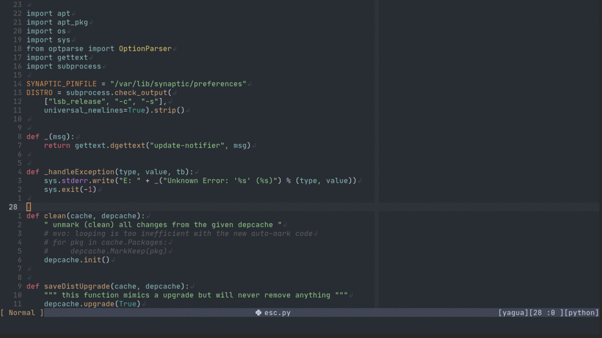
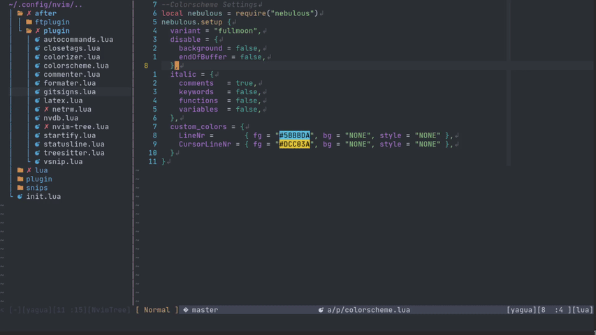

# Nebulous.nvim


Minimalist Collection of Colorschemes Written in Lua

## Features

- 4 available variants (for the moment)
- It has support for a large number of plugins such as LSP, Tree-Sitter, Telescope, Nvim-Tree and others.
- Support for Vim Terminal Colors
- Lualine scheme
- Color customization
- Italic elements in the editor
- Fun built-in functions
- They support a large number of terminal emulation environments, such as:
    - [Alacritty](https://github.com/alacritty/alacritty)
    - [Kitty](https://github.com/kovidgoyal/kitty)
    - [Tmux](https://github.com/tmux/tmux)
    - [Windows Terminal](https://github.com/microsoft/terminal)

## Prequisites

- [Neovim version 0.5+](https://github.com/neovim/neovim/releases)
- (Recommended) [Tree-Sitter](https://github.com/nvim-treesitter/nvim-treesitter) Highlight for a better use of colors

## Preview

<details>
<summary>Screenshots</summary>

#### Fullmoon



#### Midnight


#### Twilight


#### Night


</details>

## Installation

You can install colorsecheme with any package manager, for example:

##### [Packer.nvim](https://github.com/wbthomason/packer.nvim)

```lua
use 'Yagua/nebulous.nvim'
```

##### [Vim Plug](https://github.com/junegunn/vim-plug)

```vim
Plug 'Yagua/nebulous.nvim'
```

## Configuration & Use

Setup example:

```lua
--Put this lines inside your vimrc to set the colorscheme
require("nebulous").setup {
  variant = "midnight",
  disable = {
    background = true,
    endOfBuffer = false,
    terminal_colors = false,
  },
  italic = {
    comments   = false,
    keywords   = true,
    functions  = false,
    variables  = true,
  },
  custom_colors = { -- this table can hold any group of colors with their respective values
    LineNr = { fg = "#5BBBDA", bg = "NONE", style = "NONE" },
    CursorLineNr = { fg = "#E1CD6C", bg = "NONE", style = "NONE" },

    -- it is possible to specify only the element to be changed
    TelescopePreviewBorder = { fg = "#A13413" },
    LspDiagnosticsDefaultError = { bg = "#E11313" },
    TSTagDelimiter = { style = "bold,italic" },
  }
```

When overwriting the color groups of the selected variant, it is possible to
obtain their colors or those of another variant as follows:

```lua
local colors = require("nebulous.functions").get_colors("midnight") -- < variant name

require("nebulous").setup {
  ...
  custom_colors = {
    Normal = { fg = colors.Red, bg = colors.Black, style = colors.none },
  },
}
-- the '...' is used to denote the existence of other settings, this is not language syntax.
```
## Summary of options

| Option                               | Default Value |  Description                                   |
| -------------------------------------|---------------|------------------------------------------------|
| variant                              | `night`       | Select color variant                           |
| <b>disable</b>.background            | `false`       | Enable/Disable background in the editor        |
| <b>disable</b>.endOfBuffer           | `false`       | Enable/Disable lines at the end of the buffer  |
| <b>disable</b>.terminal_colors       | `false`       | Enable/Disable terminal colors                 |
| <b>italic</b>.comments               | `false`       | Enable/Disable "italic" style in comments      |
| <b>italic</b>.functions              | `false`       | Enable/Disable "italic" style in functions     |
| <b>italic</b>.variables              | `false`       | Enable/Disable "italic" style in variables     |
| <b>italic</b>.keywords               | `false`       | Enable/Disable "italic" style in keywords      |
| custom_colors                        | `{}`          | Set custom colors for editor and plugin groups |

#### Color variants

| Variant             | Value         |
| --------------------| --------------|
| night               | `default`     |
| twilight            | `alternative` |
| midnight            | `alternative` |
| fullmoon            | `alternative` |

### Lualine scheme

If you want to use the custom colorscheme of lualine, put the following code in
your init (make sure you have nebulous and [lualine](https://github.com/hoob3rt/lualine.nvim)
installed):

```lua
require('lualine').setup {
  options = {
    -- theme name
    theme = 'nebulous'
  }
}
```

## Functions

| Option                               |  Description                                      |
| -------------------------------------|---------------------------------------------------|
| `toggle_variant`                     | Browse among the different variants               |
| `random_variant`                     | Set a random variant among the different variants |
| `set_variant`                        | Set a specific variant according to its name      |
| `get_colors`                         | Get colors of the especified variant              |


##### Toggle variant


To switch between styles just run the function, e.g:

```vim
:lua require("nebulous.functions").toggle_variant()
```

The random function has a similar behavior, just call the function as well:

```vim
:lua require("nebulous.functions").random_variant()
```

You can also set a specific variant based on its name:

```vim
:lua require("nebulous.functions").set_variant("variant_name")
```

The functions can be mapped for quick use, e.g:

- Vimscript

```vim
nnoremap <silent><leader>tc :lua require("nebulous.functions").toggle_variant()<CR>
nnoremap <silent><leader>rc :lua require("nebulous.functions").random_variant()<CR>
nnoremap <silent><leader>tw :lua require("nebulous.functions").set_variant("variant_name")<CR>
```

- Lua

```lua
local setmap = vim.api.nvim_set_keymap
local options = { silent = true, noremap = true }

setmap("n", "<leader>tc", ":lua require('nebulous.functions').toggle_variant()<CR>", options)
setmap("n", "<leader>rc", ":lua require('nebulous.functions').random_variant()<CR>", options)
setmap("n", "<leader>tw", ":lua require('nebulous.functions').set_variant('variant_name')<CR>", options)
```

More features and color variants are coming in future updates!

### NOTE
- In case you find an error in any color scheme, please make an appropriate issue describing in detail the problem found.
- Also, if you want to make any contribution, please make the PR descriptive for easy integration.

I hope you enjoy these color schemes!!
