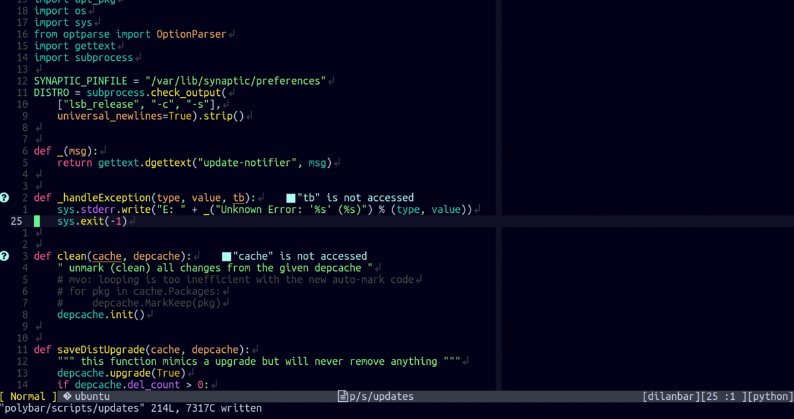
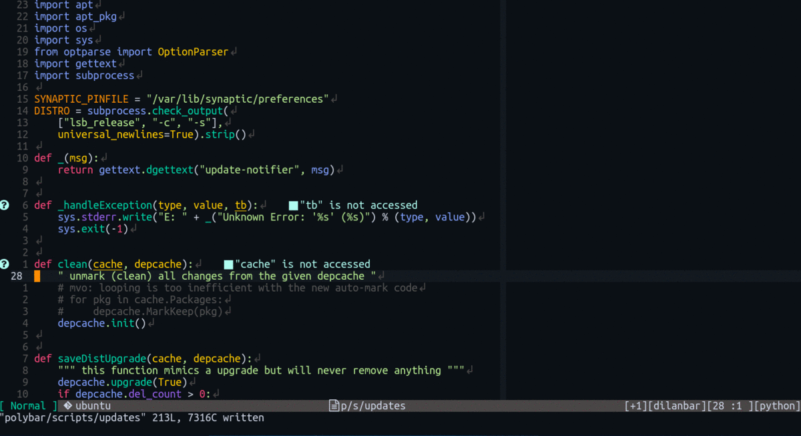
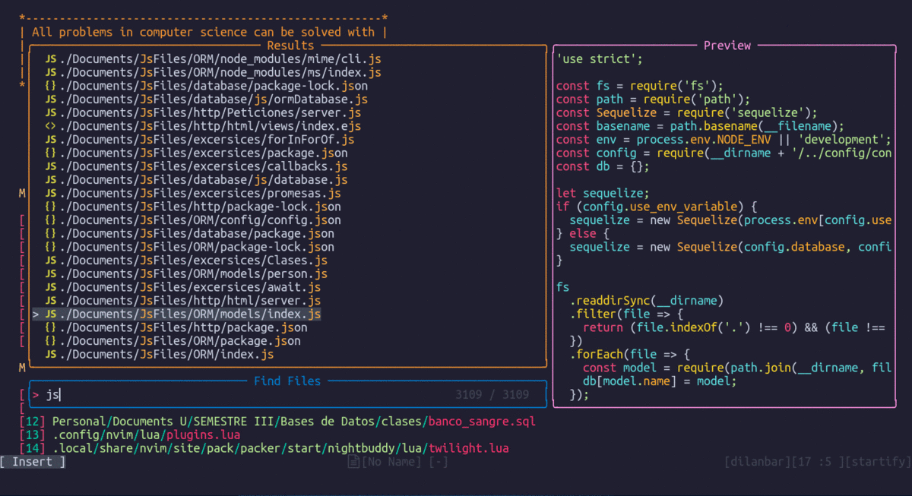
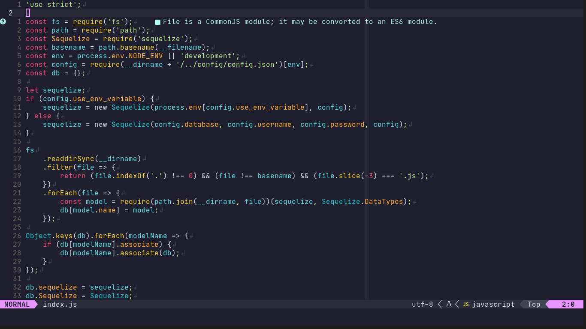

# Nebulous.nvim

```
 .    .     .         _____  .      .       *     .      0      .     .      *      .    .   ..   *
     .       .     .-'.     ':'-.                                        *       +
   .             .''   ::: .:    '.     .      '    .      .       .    '            .     |    .  .
         ,      /      :::::'      \       ()                       ()    .-.,="``"=.    - o -   .
            .  ;.   .   ':' `   .   ;    .            .      .             '=/_       \    |       .
   ,       .   |          '..       |         *                        *   |  '=._    |            .
 .             ; '  .      ::::.    ;     .                 .               \     `=./`,    .  .  *
            .   \          '::::   /   .          .               .      .   '=.__.=' `='       .   .
  .     *        '.      .  :::  .'              .       +                               .     + .
             .      '-.___'_.-'      .    O        .                O      *        '   .  .      .  .
            .              .      .    .                     .                                  .
   *   .        ****     **      .    **      .    .     **    .     .    0      *   .              .
    \     .    /**/**   /**   .      /**    .           /**  .    .                              .
     o         /**//**  /**   *****  /**       **   **  /**   ******   **   **   ****** .    +     .
      .    *   /** //** /**  **///** /******  /**  /**  /**  **////** /**  /**  **////  .             .
*      0    .  /**  //**/** /******* /**///** /**  /**  /** /**   /** /**  /** //*****   .    .      .
 .             /**   //**** /**////  /**  /** /**  /**  /** /**   /** /**  /**  /////** .           .
         \     /**    //*** //****** /******  //******  *** //******  //******  ******    .    .     .
   .      \    //      ///   //////  /////     //////  ///   //////    //////  //////         .
           \    .            .           .              .                   .          0         .
.       .   o        *            ,             .                 .           .      .      *     .   
    .      #\##\#      .                 .                   .        .-' -=;::;::`;:::`-  .     *    0
         #  #O##\###                .                      .       .-'"; `-;:"";`-;   ,;;'`-.  .
        #*#  #\##\###     0                 ()       *           .''";;:     ,..   `.;;. .';;'.    .
    .   ##*#  #\##\##               .                   .       /  ,;;::,     `--'  ,.;: ::  .;:\     .
  .      ##*#  #o##\#       *  .                0          ,   ..- .; ;:,;,,.,   ,  ;;: ::;;:..;:. .
      .     *#  #\#     .            .       .            .   ;   ;    .;::,    ;:.;:::::::::;., ;   .
                  \          .                                |;. :      ;:;       `-;:::::-'""  | .
^/\___^--____/\____O______________/\/\---/\_____/\____________| ;,'  ,;::     ;.     `-;::  `;:::|____
\^   ^  ^    ^                  ^^ ^  '\ ^          ^        ---         ---        ^
     --           -            --  -      -         ---  ___       ^   _       ^  --   -    ^    --
```


Minimalist Collection of Colorschemes Written in Lua

## Features

- These color schemes are compatible with LSP, Tree-Sitter, Telescope, Nvim-Tree and others.
- Support for Vim Terminal Colors
- Lualine scheme
- They support a large number of terminal emulation environments, such as:
    - [Alacritty](https://github.com/alacritty/alacritty)
    - [Kitty](https://github.com/kovidgoyal/kitty)
    - [Tmux](https://github.com/tmux/tmux)
    - [Windows Terminal](https://github.com/microsoft/terminal)

## Prequisites

- [Neovim version 0.5+](https://github.com/neovim/neovim/releases)
- (Recommended) [Tree-Sitter](https://github.com/nvim-treesitter/nvim-treesitter) Highlight for a better use of colors

## Installation

You can install colorsecheme with any package manager, for example:

##### [Packer.nvim](https://github.com/wbthomason/packer.nvim)

```lua
use 'DilanGMB/nebulous.nvim'
```

##### [Vim Plug](https://github.com/junegunn/vim-plug)

```vim
Plug 'DilanGMB/nebulous.nvim'
```

## Configuration & Use

##### VimScript

```vim
" Put this lines inside your vimrc to set the colorscheme
colorscheme nebulous
" or
lua require("nebulous").setup()
```

##### Lua

```lua
-- Put this lines inside your vimrc to set the colorscheme
require("nebulous").setup()
--or
vim.cmd("colorscheme nebulous")
```

## Colorscheme Settings

It is important to mention that the configurations listed hereafter, have to be
set before loading the colorscheme.

##### Color variants

| Variant             | Value         |
| --------------------| --------------|
| night               | `default`     |
| twilight            | `alternative` |
| midnight            | `alternative` |

More variants coming soon !!

Example of use:
##### Lua

```lua
vim.g.nb_style = "night"
require("nebulous").setup()
```

##### VimScript

```vim
let g:nb_style = "night"
colorscheme nebulous
```

## Preview

#### Twilight



#### Night



#### Midnight



### Lualine scheme

If you want to use the custom colorscheme of lualine, put the following code in
your init (make sure you have nebulous and lualine installed, otherwise it may not work):

##### Lua

```lua
require('lualine').setup {
  options = {
    -- theme name
    theme = 'nebulous'
  }
}
```

## Preview


## Summary of options

| Option                | Default Value |  Description                         |
| ----------------------|---------------|------------------------------------- |
| nb_style              | `night`       | Select color variant                 |
| nb_disable_background | `false`       | Disable background in the editor     |
| nb_italic_comments    | `false`       | Enable "italic" style in comments    |
| nb_italic_functions   | `false`       | Enable "italic" style in functions   |
| nb_italic_variables   | `false`       | Enable "italic" style in variables   |
| nb_italic_keywords    | `false`       | Enable "italic" style in keywords    |

Example of use:

```lua
--Nebulous Settings
vim.g.nb_disable_background = true
vim.g.nb_italic_comments  = false
vim.g.nb_italic_keywords  = true
vim.g.nb_italic_functions = false
vim.g.nb_italic_variables = true
vim.g.nb_style = "midnight"

require("nebulous").setup()
```
More features to come in future updates

### NOTE
- In case you find an error in any color scheme, please make an appropriate issue describing in detail the problem found.
- Also, if you want to make any contribution, please make the PR descriptive for easy integration.

I hope you enjoy these color schemes!!
